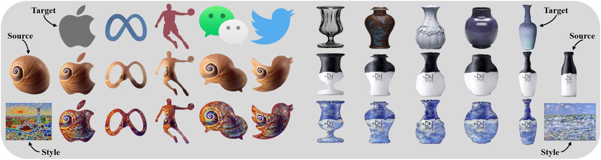

# InST: Industrial Style Transfer with Large-scale Geometric Warping and Content Preservation
<!-- **Industrial Style Transfer with Large-scale Geometric Shape** -->
This repository contains the source code for our paper:

[Industrial Style Transfer with Large-scale Geometric Warping and Content Preservation](https://jcyang98.github.io/InST/home.html)<br/>CVPR 2022 <br/>Jinchao Yang, Fei Guo, Shuo Chen, Jun Li and Jian Yang<br/>




### Requirement
Install PyTorch 1.6.0+ and corresponding package
```
pip install -r requirements.txt
```
Install PointRender backup to segment images during test time.
```
git clone https://github.com/facebookresearch/detectron2.git
pip install -e detectron2/
```

### Data preparation
You should prepare the source mask dataset and the target mask dataset respectively.
```
/path/to/source_mask_root
    mask1.jpg
    mask2.jpg

/path/to/target_mask_root
    mask1.jpg
    mask2.jpg
```

### Evaluation
Using PointRender to segment source and target images. This will take a while.(you should make sure the object can be segmented by PointRender)
```
python test_LGW.py --source_path path/to/source_img --target_path /path/to/target_img --checkpoint /path/to/checkpoint
```
If you want to save time and generate more accurate results, you can provide source mask and target mask path in the command line.
```
python test_LGW.py --source_path path/to/source_img --source_mask_path /path/to/source_mask --target_mask_path /path/to/target_mask --checkpoint /path/to/checkpoint
```

### Training
```
CUDA_VISIBLE_DEVICES=0 python main.py --source_dir /path/to/source_mask_root --target_dir /path/to/target_mask_root 
```

### Acknowledgments
Parts of the code are based on [RAFT](https://github.com/princeton-vl/RAFT).

If you find this code useful for your research, please cite
```
@InProceedings{jcyang2022InST,
    title = {Industrial Style Transfer with Large-scale Geometric Warping and Content Preservation},
    author = {Jinchao Yang and Fei Guo and Shuo Chen and Jun Li and Jian Yang},
    booktitle = {CVPR},
    year = {2022},
}
```